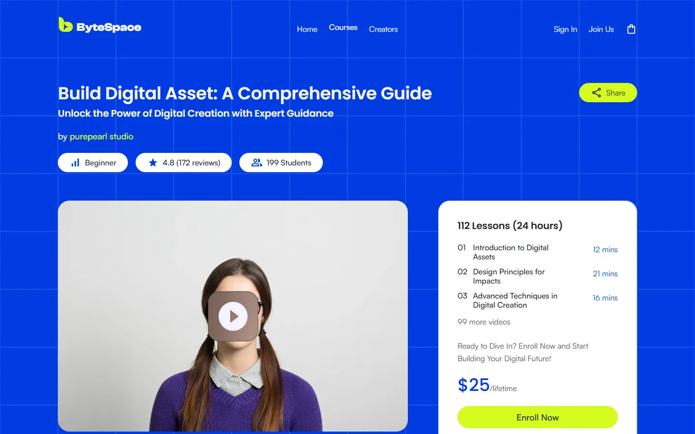
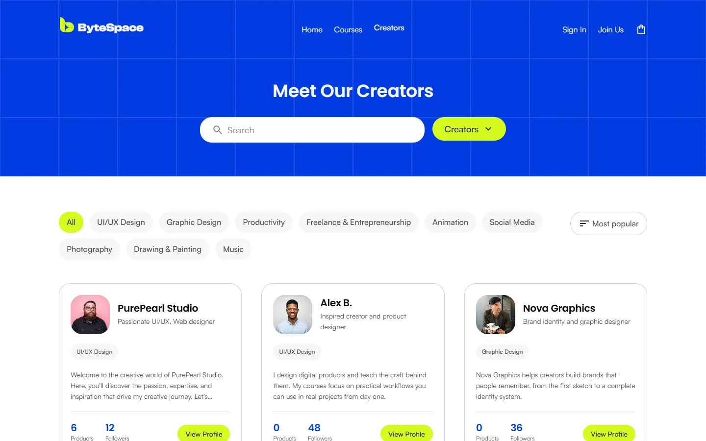
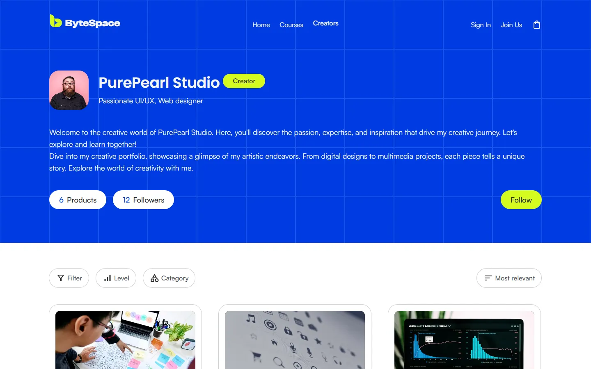

# ByteSpace

A marketing and course platform website for ByteSpace, built from the Figma design as a frontend assessment.

**Live site:** https://byte-space-theta.vercel.app
**Repository:** https://github.com/emonOPL/ByteSpace


## Tech Stack

| Area       | Tools                                                             |
| ---------- | ----------------------------------------------------------------- |
| UI         | React 19                                                          |
| Build      | Vite 8                                                            |
| Styling    | Tailwind CSS v4 (CSS-first `@theme` tokens), clsx, tailwind-merge |
| Routing    | React Router 8 (data router, lazy routes, loaders)                |
| Forms      | react-hook-form, zod, @hookform/resolvers                         |
| Quality    | oxlint, Prettier with prettier-plugin-tailwindcss                 |
| Deployment | Vercel                                                            |

## Pages and Routes

| Route             | Page            | Notes                                                                |
| ----------------- | --------------- | -------------------------------------------------------------------- |
| `/`               | Home            | Landing page with every section from the design                      |
| `/courses`        | Course listing  | Search, level, category and sort filters, category tabs, pagination  |
| `/courses/:slug`  | Course details  | About, Lessons and Reviews tabs (`?tab=`), review filter, share link |
| `/creators`       | Creators        | Search, specialty tabs and sort                                      |
| `/creators/:slug` | Creator profile | Profile, follow toggle and the creator's courses with filters        |
| `/login`          | Sign in         | Validated form                                                       |
| `/signup`         | Create account  | Validated form                                                       |
| any other path    | 404             | Also shown for an unknown course or creator slug                     |

Filters, search, pagination and the active tab live in the URL, so every state can be shared or bookmarked.

## Getting Started

Requires Node.js 20.19+ or 22.12+.

```bash
npm install
npm run dev
```

| Command                | Description                       |
| ---------------------- | --------------------------------- |
| `npm run dev`          | Start the development server      |
| `npm run build`        | Build for production into `dist/` |
| `npm run preview`      | Preview the production build      |
| `npm run lint`         | Lint with oxlint                  |
| `npm run format`       | Format with Prettier              |
| `npm run format:check` | Check formatting without writing  |

## Project Structure

```
public/            static files served as-is (fonts, favicon, robots.txt)
src/
  assets/          icons and images exported from Figma
  components/
    cards/         CourseCard, CreatorCard, ReviewCard, TestimonialCard, ...
    layout/        Header, Footer, MainLayout, AuthLayout, PageMeta, RouteError
    ui/            reusable primitives: Button, PillButton, Dropdown, Tabs, Pagination, ...
  data/            page copy and content (courses, creators, navigation, ...)
  hooks/           useCourseFilters, useCreatorFilters, useAuthForm, useScrolled
  lib/             cn(), focus ring, validation schemas
  pages/           one component per route
  sections/        page sections grouped by page (home, courses, course, creator, ...)
  index.css        Tailwind import, design tokens (@theme) and base layer
  router.jsx       route table
```

Pages compose sections, sections use layout and UI components, and all copy lives in `src/data` so components stay free of hard-coded content.

## Implementation Notes

- **Design tokens.** Colors, font families and composite text styles (`text-heading-l`, `text-body-m`, `text-label-s`, ...) come from the Figma styles and live in the `@theme` block of `src/index.css`. Styling uses Tailwind classes only.
- **Fonts.** Satoshi, Poppins and Clash Display are self-hosted as woff2 and preloaded to avoid layout shift.
- **Performance.** Every page except Home is code-split. Images have explicit sizes, below-the-fold images load lazily, and the hero images are fetched with high priority. Cumulative Layout Shift is 0 on every page.
- **SEO.** Each page sets its own title and meta description. Open Graph and Twitter card tags with a preview image and `robots.txt` are included, and the 404 page is marked `noindex`.
- **Accessibility.** Semantic landmarks and headings, keyboard support for tabs, dropdowns and the mobile menu, visible focus rings, live regions for result counts, and form errors linked to their fields with `aria-describedby`.
- **Deployment.** `vercel.json` rewrites every path to `index.html`, so client-side routes work on refresh and unknown paths show the custom 404 page.

## Design Interpretation

The layout matches the Figma frames at 1440px, and every page was compared pixel by pixel against its frame. Some choices were needed where the design was silent or inconsistent:

- **Responsive layouts.** The design has desktop frames only. Mobile and tablet layouts follow the same structure and were tested from 320px to 2560px.
- **Consistency between frames.** Where frames of the same page disagreed, one value was used everywhere. For example, the tab bar position on the course details tabs, review text line height, the tab label "Lessons", and content aligned to the 120px grid.
- **Content fixes.** A placeholder creator name and a typo in the creator bio were corrected, and the creator's product count is calculated from their courses.
- **Small enhancements.** Sticky header that turns blue on scroll, a mobile menu, dimmed stars in the rating breakdown, empty states for searches with no results, and a copy-link share button.
- **Creators page.** There is no Figma frame for `/creators`. It was designed with the same hero, filter and card patterns as the course listing. The design contains one real creator, so the other creators are sample profiles that use avatars from the design.

## Known Limitations

- There is no backend. Sign in and sign up validate the form and simulate a request, and the follow button is not saved.
- The cart icon links to `/cart`, which shows the 404 page because the design has no cart page.
- Sample creators have no courses, because every course in the design belongs to PurePearl Studio.
- Two gray text colors from the design (`#82868e` and `#888888` on white) are below the WCAG AA contrast ratio for body text. They were kept to match the design.

## Git Workflow

Each phase was built on its own branch and merged into `main` through a pull request:

| PR     | Branch            | Scope                                             |
| ------ | ----------------- | ------------------------------------------------- |
| #1, #2 | `design-system`   | Project setup and design tokens                   |
| #3     | `landing-page`    | Home page                                         |
| #4     | `auth-pages`      | Sign in and sign up                               |
| #5     | `courses`         | Course listing                                    |
| #6     | `course-details`  | Course details                                    |
| #7     | `creator-profile` | Creator profile                                   |
| #8     | `not-found`       | 404 page                                          |
| #9     | `polish-and-docs` | Creators page, SEO, performance and documentation |

## Screenshots

| Courses                                          | Course details                                            |
| ------------------------------------------------ | --------------------------------------------------------- |
|  |    |
| **Creators**                                     | **Creator profile**                                       |
|       |  |


